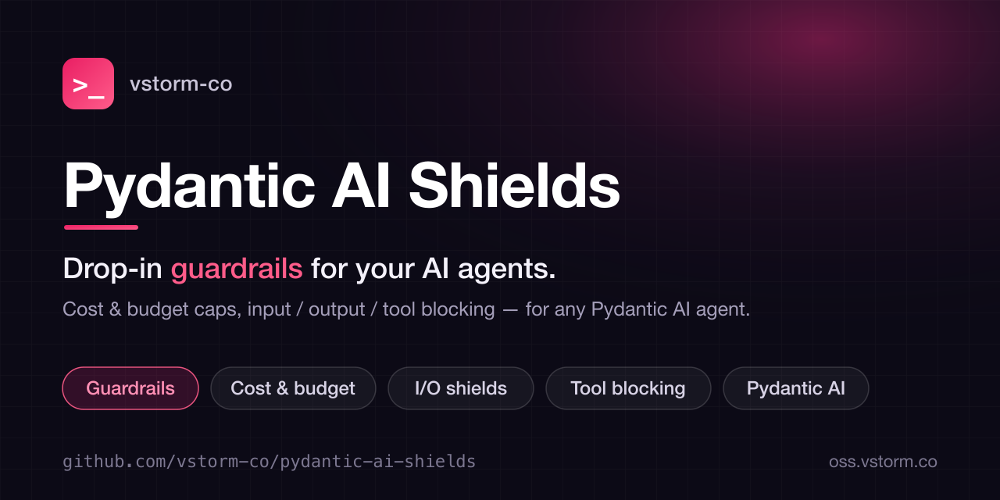

<p align="center">
  
</p>

<h1 align="center">Pydantic AI Shields</h1>

<p align="center"><em>Drop-in guardrails for your AI agents.</em></p>

<p align="center">
  <a href="https://pypi.org/project/pydantic-ai-shields/"></a>
  <a href="https://pepy.tech/projects/pydantic-ai-shields"></a>
  <a href="https://github.com/vstorm-co/pydantic-ai-shields/stargazers"></a>
  <a href="https://www.python.org/downloads/"></a>
  <a href="https://opensource.org/licenses/MIT"></a>
  <a href="https://github.com/vstorm-co/pydantic-ai-shields/actions/workflows/ci.yml"></a>
  <a href="https://github.com/pydantic/pydantic-ai"></a>
</p>

---

!!! tip "Part of Pydantic Deep Agents"
    **Pydantic AI Shields** is one library in [Pydantic Deep Agents](https://github.com/vstorm-co/pydantic-deepagents) — the open-source
    Claude Code alternative & Python agent framework. Use it standalone, or get every
    library wired together in a single `create_deep_agent()` call.

**Pydantic AI Shields** provides ready-to-use guardrail [capabilities](https://ai.pydantic.dev/capabilities/) for [Pydantic AI](https://ai.pydantic.dev/) agents. Drop them into any agent for cost control, tool permissions, content safety, and more.

## Quick Start

```python
from pydantic_ai import Agent
from pydantic_ai_shields import (
    CostTracking, PromptInjection, PiiDetector, SecretRedaction,
)

agent = Agent(
    "openai:gpt-4.1",
    capabilities=[
        CostTracking(budget_usd=5.0),
        PromptInjection(sensitivity="high"),
        PiiDetector(),
        SecretRedaction(),
    ],
)
```

## Available Shields

### Infrastructure Shields

| Shield | Description |
|--------|-------------|
| [`CostTracking`][pydantic_ai_shields.guardrails.CostTracking] | Token/USD tracking with budget enforcement |
| [`ToolGuard`][pydantic_ai_shields.guardrails.ToolGuard] | Block tools or require human approval |
| [`InputGuard`][pydantic_ai_shields.guardrails.InputGuard] | Custom input validation (pluggable function) |
| [`OutputGuard`][pydantic_ai_shields.guardrails.OutputGuard] | Custom output validation (pluggable function) |
| [`AsyncGuardrail`][pydantic_ai_shields.guardrails.AsyncGuardrail] | Run guard concurrently with LLM call |

### Content Shields

| Shield | Description |
|--------|-------------|
| [`PromptInjection`][pydantic_ai_shields.shields.PromptInjection] | Detect prompt injection / jailbreak (6 categories, 3 sensitivity levels) |
| [`PiiDetector`][pydantic_ai_shields.shields.PiiDetector] | Detect PII — email, phone, SSN, credit card, IP |
| [`SecretRedaction`][pydantic_ai_shields.shields.SecretRedaction] | Block API keys, tokens, credentials in output |
| [`BlockedKeywords`][pydantic_ai_shields.shields.BlockedKeywords] | Block forbidden keywords/phrases |
| [`NoRefusals`][pydantic_ai_shields.shields.NoRefusals] | Block LLM refusals ("I cannot help with that") |

## Next Steps

- [Installation](installation.md) — install the package
- [Examples](examples/index.md) — real-world usage patterns
- [API Reference](api/index.md) — full API docs
